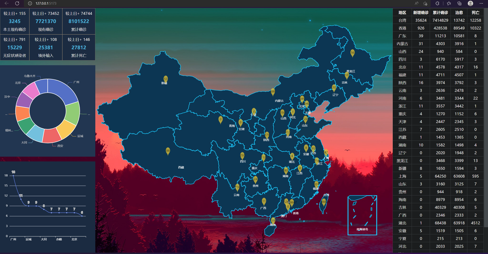

# coronavirusVisualization
新冠疫情的可视化

> 项目启动方法

vue-project-01-back

```
cd vue-project-01-back
npm install
npm run dev
```

vue-project-01-front

```
cd vue-project-01-front
npm install 
npm run dev
```

项目截图




基于vue3的一个简单练手项目，主要是熟悉一些操作，可以作为练手学习

本项目采用的是vue3的全新语法，如果你对vue3的新语法有兴趣，可以简单查看本项目
本项目采用的接口数据是由腾讯提供的官方数据源，如果挂了，本项目也就没用了

😊😊😊😊
